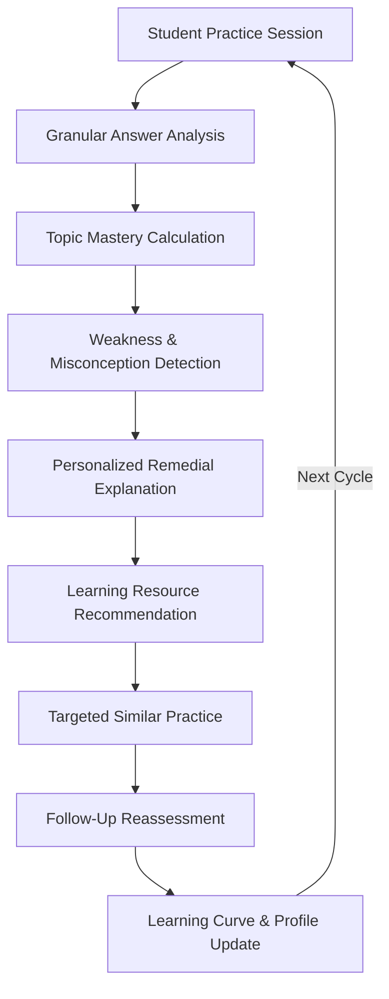
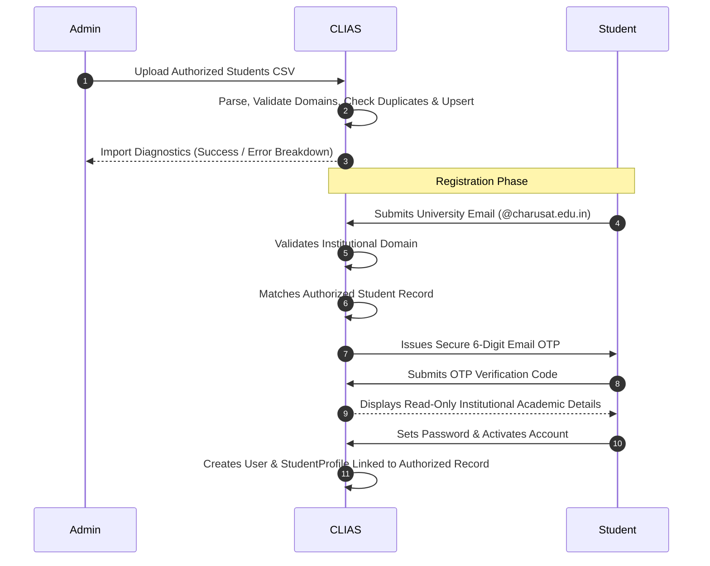
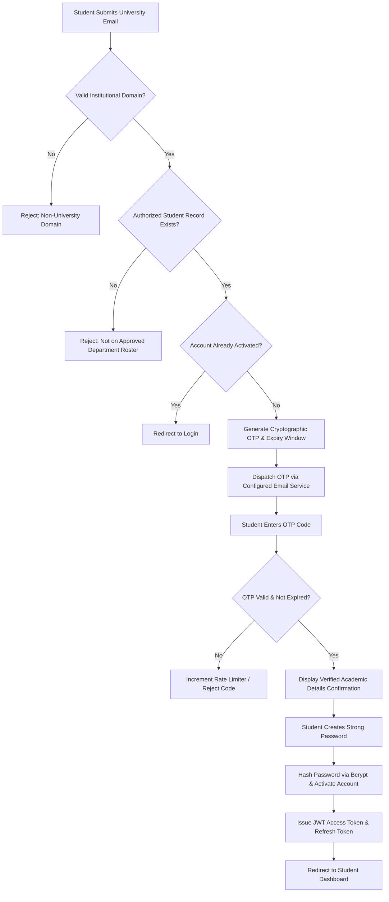
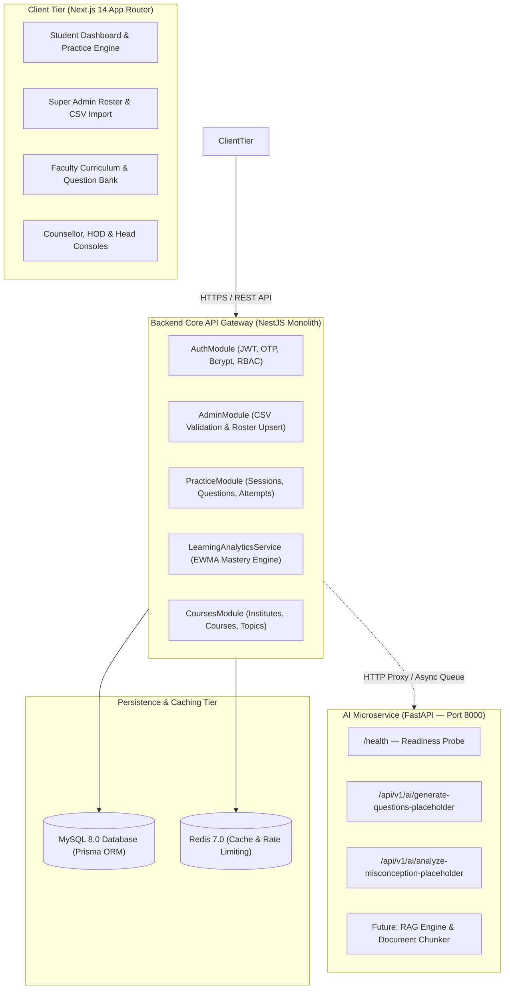
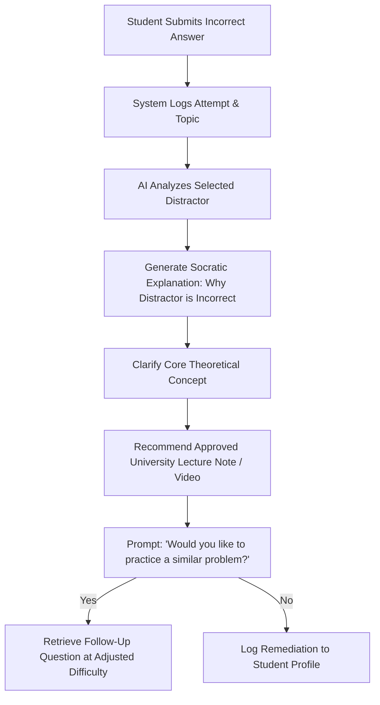
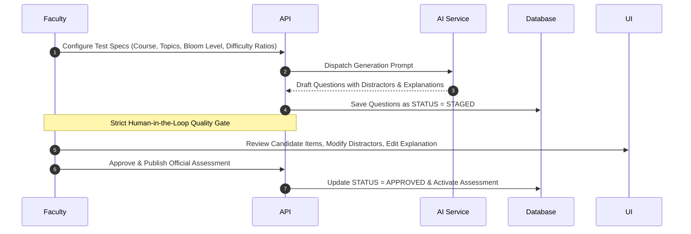
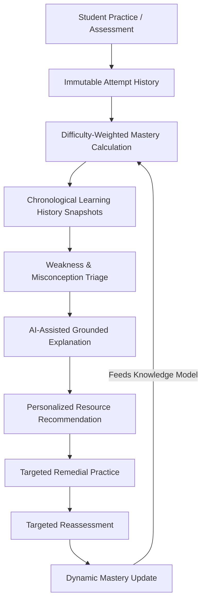
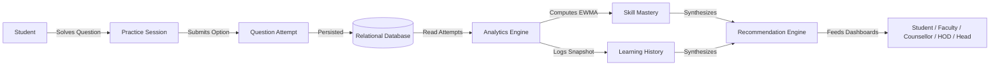

# CLIAS — CHARUSAT Learning Intelligence & Assessment System

> **An AI-powered learning intelligence, adaptive practice, assessment, analytics, and exam integrity platform for university students.**

[](#)
[-blue.svg)](#)
[-emerald.svg)](#)
[](#)

---

## Table of Contents

1. [Project Overview](#1-project-overview)
2. [Core Learning Intelligence Loop](#2-core-learning-intelligence-loop)
3. [Key Differentiator: Continuous Student Knowledge Model](#3-key-differentiator-continuous-student-knowledge-model)
4. [User Roles & Access Control](#4-user-roles--access-control)
5. [University Data Model & Import Engine](#5-university-data-model--import-engine)
6. [Registration & Authentication Architecture](#6-registration--authentication-architecture)
7. [Technology Stack](#7-technology-stack)
8. [System Architecture](#8-system-architecture)
9. [Phased Development Roadmap](#9-phased-development-roadmap)
   - [Phase 1: Platform Foundation](#phase-1--platform-foundation)
   - [Phase 2: Learning Intelligence](#phase-2--learning-intelligence)
   - [Phase 3: AI Learning Assistant](#phase-3--ai-learning-assistant)
   - [Phase 4: Misconception Detection & Adaptive Learning](#phase-4--misconception-detection--adaptive-learning)
   - [Phase 5: Assessment Engine](#phase-5--assessment-engine)
   - [Phase 6: AI Assessment Generation](#phase-6--ai-assessment-generation)
   - [Phase 7: Document-Based AI / RAG](#phase-7--document-based-ai--rag)
   - [Phase 8: University Analytics](#phase-8--university-analytics)
   - [Phase 9: Proctored Assessment (AI Integrity Monitoring)](#phase-9--proctored-assessment-ai-integrity-monitoring)
   - [Phase 10: Target Role & Placement Readiness](#phase-10--target-role--placement-readiness)
10. [Long-Term Learning Intelligence Model](#10-long-term-learning-intelligence-model)
11. [System Data Flow](#11-system-data-flow)
12. [Database Entities](#12-database-entities)
13. [Security & Privacy Architecture](#13-security--privacy-architecture)
14. [Privacy Principles](#14-privacy-principles)
15. [Current Project Status](#15-current-project-status)
16. [Roadmap Summary Table](#16-roadmap-summary-table)
17. [Project Development Principles](#17-project-development-principles)
18. [Future Improvements](#18-future-improvements)
19. [Setup & Development Guide](#19-setup--development-guide)
20. [Development Demo Credentials](#20-development-demo-credentials)
21. [Recommended Demonstration Flow](#21-recommended-demonstration-flow)

---

## 1. Project Overview

**CLIAS** (CHARUSAT Learning Intelligence & Assessment System) is designed to solve a fundamental deficiency in higher education software: **conventional Learning Management Systems (LMS) and quiz portals record static examination marks, but fail to measure actual learning progression over time.**

A standard grade sheet records that a student scored 14 out of 20 on an assessment. It cannot answer whether the student guessed easy questions, mastered difficult algorithmic concepts, struggled with recursion, or experienced severe knowledge decay over the subsequent six weeks.

CLIAS addresses this by continuously understanding a student's learning progress throughout their university tenure. The platform systematically tracks:

- **What students practice**: Detailed interaction history, time spent per question, streaks, and session cadence.
- **Which topics they understand**: Fine-grained topic mastery calculated dynamically based on correctness and question difficulty.
- **Where they repeatedly struggle**: Specific subtopics and conceptual pitfalls where errors cluster.
- **How their mastery changes over time**: Longitudinal learning curves capturing growth, plateaus, and skill decay.
- **Which learning resources may help**: Curated readings, video walkthroughs, and targeted remedial explanations.
- **What they should practice next**: Personalized difficulty-adjusted questions designed to bridge verified skill gaps.

### Multi-Tier Academic Intelligence

The platform synthesizes raw practice and assessment data into actionable intelligence across five distinct institutional tiers:

```
Student ──► Faculty ──► Counsellor ──► HOD ──► Head / Institutional Administration
```

- **Student**: Receives transparent self-directed mastery feedback, weak area alerts, and personalized practice.
- **Faculty**: Monitors class-wide concept mastery, discovers collective misconceptions, and orchestrates curriculum coverage.
- **Counsellor**: Identifies assigned mentees exhibiting disengagement, declining learning curves, or persistent distress before exams occur.
- **Head of Department (HOD)**: Evaluates curriculum health across semesters, divisions, and courses to inform pedagogical interventions.
- **Institutional Head / Provost**: Reviews cross-departmental readiness, cohort performance trends, and accreditation indicators.

The long-term vision of CLIAS is to serve as an **institutional learning intelligence backbone** across university departments.

---

## 2. Core Learning Intelligence Loop

The foundational concept of CLIAS is the **continuous learning loop**, rather than the episodic execution of isolated exams:



Unlike transactional examination tools where an incorrect answer terminates with a score deduction, CLIAS uses every mistake as a diagnostic trigger to remediate the student's knowledge model and adapt subsequent practice.

---

## 3. Key Differentiator: Continuous Student Knowledge Model

CLIAS is deliberately **not** intended to be:
- Just another Learning Management System (LMS) for PDF distribution.
- A superficial quiz website with static multiple-choice questions.
- A rigid online examination lock-box that merely records pass/fail flags.
- An ungrounded conversational AI chatbot detached from university coursework.

### The Student Knowledge Model

The central differentiator is a continuously evolving, multi-dimensional **Student Learning Profile / Knowledge Model**. Rather than reducing a student's semester to a single GPA figure, CLIAS maintains a live, granular competency vector across every course topic.

#### Example: Data Structures & Algorithms (CS301)
```
┌─────────────────────────────────────────────────────────────┐
│ Rahul Patel (24CS001) — Knowledge Model Snapshot            │
├─────────────────────────────────────────────────────────────┤
│ Arrays & Dynamic Arrays          ███████████████████░  91%  │
│ Linked Lists & Pointers          ███████████████░░░░░  76%  │
│ Trees & Binary Search Trees      ██████████████░░░░░░  68%  │
│ Graph Algorithms & Traversals    █████████░░░░░░░░░░░  47%  │
│ Dynamic Programming              ██████░░░░░░░░░░░░░░  31%  │
└─────────────────────────────────────────────────────────────┘
```

This model is dynamic:
1. Solving a **Hard** graph problem correctly increases mastery more than solving a trivial definition question.
2. Answering incorrectly penalizes mastery in proportion to the concept's difficulty.
3. Recent practice carries higher weight than activity recorded months prior (via exponential moving average decay).
4. All downstream recommendations, faculty analytics, and future adaptive pathways read directly from this knowledge model.

CLIAS does not claim that knowledge modeling is globally unprecedented; rather, it provides a practical, university-integrated architecture tailored to institutional workflows.

---

## 4. User Roles & Access Control

CLIAS enforces strict **Role-Based Access Control (RBAC)** on both client routes and API endpoints via server-side guards:

| Role | Primary Purpose | Scope of Access |
|---|---|---|
| **Student** | Practice, assessments, analytics, and self-remediation | Strictly restricted to self-profile, enrolled courses, and assigned tests |
| **Faculty** | Create/manage question banks, configure assessments, monitor class performance | Scoped to assigned courses, class divisions, and enrolled cohorts |
| **Counsellor** | Monitor assigned mentees, track engagement, trigger early academic intervention | Scoped exclusively to assigned students via `CounsellorAssignment` records |
| **HOD** | Department-level curriculum health, division comparisons, learning trends | Scoped to all programs, courses, and faculty within their academic department |
| **Head** | High-level institutional analytics, macro benchmarks, accreditation readiness | Aggregate cross-departmental and cross-institute analytics |
| **Super Admin** | Manage authorized student rosters, institutional structures, and global configuration | Full administrative access across all system entities |

### RBAC Enforcement Architecture
- **JWT Claims**: Tokens encode cryptographic user IDs, verified university emails, and authorized roles.
- **Server Guards**: NestJS `@Roles(...)` metadata combined with `RolesGuard` and `JwtAuthGuard` validate permissions before controller handlers execute.
- **Data Isolation**: Database queries enforce tenant boundaries (e.g., students cannot access arbitrary student IDs; counsellors can only query assigned student IDs).

---

## 5. University Data Model & Import Engine

### Institutional Constraint & Realistic Decoupling
In real-world university environments, engineering teams rarely have direct write access to central student information databases (ERP/SIS) due to security policies, legacy infrastructure, and administrative firewalls.

CLIAS resolves this constraint through its **Authorized Student Import Engine**:



### Authoritative Academic Roster Attributes
Administrators upload standardized CSV rosters containing:
- **Enrollment Number** (e.g., `24CS001`)
- **Student Full Name**
- **University Email** (`@charusat.edu.in`)
- **Institute Code** (e.g., `CSPIT`)
- **Department Code** (e.g., `CSE`)
- **Program Code / Name** (e.g., `BTECH_CSE`)
- **Semester** (e.g., `5`)
- **Division** (e.g., `A`)
- **Graduation Year** (e.g., `2026`)

**Zero Self-Declaration**: Students cannot self-assign their enrollment number, department, semester, or division during registration. All authoritative academic metadata is inherited strictly from the pre-approved institutional roster.

---

## 6. Registration & Authentication Architecture

### Production-Grade Authentication Flow



### Security & Integrity Controls
- **Bcrypt Password Hashing**: Passwords hashed with high-cost salt rounds before storage.
- **Domain Whitelisting**: Dynamic validation against `UNIVERSITY_EMAIL_DOMAIN` (default: `charusat.edu.in`).
- **OTP Lifecycle**: Time-bound 6-digit codes (10-minute expiration), single-use invalidation, and strict rate-limiting to prevent brute force attacks.
- **Dual-Token JWT Pipeline**: Short-lived access tokens accompanied by secure refresh tokens.
- **Duplicate Prevention**: Unique constraints on user email and enrollment number prevent duplicate registrations.

### Future Capability: University SSO
When institutional access is formally granted, CLIAS is architected to integrate with the university's official identity provider via **SAML 2.0 / OAuth2 / OpenID Connect (OIDC)**, preserving the same underlying student profile mapping.

---

## 7. Technology Stack

The platform is constructed as a modern, modular monorepo using industry-standard enterprise frameworks.

### Current Implementation Stack

| Layer | Technology | Version / Specification | Purpose in CLIAS |
|---|---|---|---|
| **Frontend Framework** | Next.js (App Router) | React 18 / Next 14 | Responsive role-based portal, server & client rendering |
| **Language** | TypeScript | v5.3+ | End-to-end type safety across client, server, and packages |
| **Styling & UI** | Tailwind CSS | v3.4 | Modern SaaS interface, custom color tokens, micro-interactions |
| **Icons & Visuals** | Lucide React | v0.344+ | Consistent icon design system |
| **Analytics Charts** | Recharts | v2.12+ | Dynamic learning curves, topic distribution, mastery graphs |
| **Backend Framework** | NestJS | v10.3 | Modular API architecture, dependency injection, controllers |
| **ORM & Schema** | Prisma ORM | v5.10 | Type-safe database queries, declarative migrations, schema management |
| **Primary Database** | MySQL | 8.0+ / MariaDB | Strongly normalized relational storage, ACID compliance |
| **Caching & State** | Redis | 7.0+ (Alpine) | Session caching, rate limiting, and OTP state store (in-memory fallback) |
| **Authentication** | Passport JWT & Bcrypt | JWT / Bcrypt.js | Cryptographic token verification and secure password hashing |
| **AI Microservice** | Python & FastAPI | Python 3.10+, FastAPI 0.110+ | Standalone microservice for future LLM assessment generation & RAG |
| **Containerization** | Docker Compose | v3.8 spec | Multi-container setup for local MySQL and Redis instances |

### Planned Technologies (Future Roadmap)

| Capability | Target Technology | Intended Role |
|---|---|---|
| **Vector Storage & RAG** | pgvector / Qdrant / ChromaDB | Semantic retrieval of university syllabus, lecture notes, and PPTs |
| **LLM Orchestration** | LangChain / LlamaIndex | Automated question generation pipelines and Socratic chat agents |
| **Advanced Knowledge Modeling** | Python `pyBKT` / `scikit-survival` | Bayesian Knowledge Tracing and Item Response Theory parameter estimation |
| **Face Biometric Embeddings** | OpenCV / MediaPipe / FaceNet | Client-side gaze tracking and on-demand face liveness verification |
| **Real-Time Proctoring Stream** | WebRTC / WebSocket Gateway | Low-latency behavioral event streaming during institutional exams |

---

## 8. System Architecture



---

## 9. Phased Development Roadmap

The platform is engineered incrementally across ten structured phases. Each phase represents a distinct, verifiable upgrade to the system's capabilities.

```
Phase 1: Foundation (✅ Completed)
    ↓
Phase 2: Learning Intelligence (✅ Completed)
    ↓
Phase 3: AI Learning Assistant (✅ Completed)
    ↓
Phase 4: Misconception Detection & Adaptive Learning (⏳ Planned)
    ↓
Phase 5: Assessment Engine (⏳ Planned)
    ↓
Phase 6: AI Assessment Generation (⏳ Planned)
    ↓
Phase 7: Document-Based AI / RAG (⏳ Planned)
    ↓
Phase 8: University Analytics (⚠️ Partially Implemented)
    ↓
Phase 9: Proctored Assessment (⏳ Planned)
    ↓
Phase 10: Target Role / Placement Readiness (⏳ Planned)
```

---

### PHASE 1 — PLATFORM FOUNDATION
**Status**: ✅ Completed  
**Goal**: Build the secure, fully functional, multi-tier operational foundation of the university platform.

- **Authentication & RBAC**:
  - University email domain validation (`charusat.edu.in`).
  - Development email OTP dispatch and verification.
  - Bcrypt password hashing and JWT token issuance.
  - Role-Based Access Control protecting routes across 6 roles.
- **Authorized Student Management**:
  - Authorized student database schema with academic metadata.
  - Super Admin CSV upload with parsing diagnostics and batch upsert.
  - Student self-registration anchored to authoritative roster.
- **Academic Hierarchy**:
  - Full relational hierarchy: Institute -> Department -> Program -> Course -> Topic.
  - Topic self-relation supporting subtopic trees.
- **Question Bank MVP**:
  - Question schema with difficulties (`EASY`, `MEDIUM`, `HARD`) and types (`MCQ_SINGLE`).
  - Detailed answer explanations and source tracking (`MANUAL`).
  - Seeded with 35+ verified questions across 7 core DSA topics.
- **Practice Session MVP**:
  - Filter questions by course, topic, and difficulty.
  - Single-question interactive flow with option submission.
  - Zero answer leakage: correct answers evaluated securely server-side.
  - Instant explanation feedback, timer tracking, and attempt logging.
- **Initial Dashboards**:
  - Student Dashboard with real dynamic Recharts curve, mastery progress bars, weak/strong focus cards, and activity timeline.
  - Super Admin Dashboard with CSV import and roster management.
  - Functional role shells for Faculty, Counsellor, HOD, and Head.

---

### PHASE 2 — LEARNING INTELLIGENCE
**Status**: ✅ Completed  
**Goal**: Transform raw practice logs into mathematically rigorous, transparent learning analytics.

- **Completed Deliverables**:
  - **Dynamic Mastery Modeling**: Difficulty-weighted Exponentially Weighted Moving Average (EWMA) heuristic ($\alpha = 0.25$, weights: $1.0\times$ Easy, $1.25\times$ Medium, $1.5\times$ Hard).
  - **Bayesian Knowledge Tracing (BKT)**: Dedicated `BktIrtEngine` implementing probabilistic knowledge state tracking $P(L_t)$ with canonical parameters ($P(L_0)=0.20, P(T)=0.15, P(G)=0.20, P(S)=0.10$), step progression, and transparent EWMA vs BKT benchmarking.
  - **Item Response Theory (IRT)**: 2PL logistic response model evaluating student latent ability parameter $\theta$ (-3.0 to +3.0) and ability percentile rank.
  - **Ebbinghaus Forgetting Curves & Knowledge Retention**: Mathematical stability half-life calculation $S$, retention rate $R(t) = e^{-t/S}$, effective decayed mastery scores, and automated spaced repetition review triggers via `ForgettingCurveEngine`.
  - **Multi-Topic Knowledge Dependency Graphs**: Curriculum Directed Acyclic Graphs (DAGs) defining pedagogical prerequisite trees (e.g. Arrays $\to$ Linked Lists $\to$ Stacks/Queues $\to$ Trees $\to$ Graphs $\to$ Dynamic Programming), automated readiness validation, and prerequisite deficit warnings via `KnowledgeGraphEngine`.
  - **Multi-Tier Cohort Analytics**: Live aggregate learning analytics for Faculty (class mastery distributions, at-risk students, bottleneck topics), Counsellors (scoped mentee tracking, decay alerts), HOD (department-wide curriculum health), and Head (institutional indicators).
  - **Interactive Learning Intelligence Console**: Student dashboard panel featuring side-by-side BKT benchmarking, Ebbinghaus decay indicators, and interactive prerequisite DAG exploration (`Phase2IntelligencePanel`).
  - **Automated Verification**: Comprehensive unit test suite covering EWMA, BKT posterior updates, IRT ability estimation, forgetting curves, and DAG prerequisite validation (21/21 tests passing).

---

### PHASE 3 — AI LEARNING ASSISTANT
**Status**: ✅ Completed  
**Goal**: Provide grounded, Socratic assistance whenever a student answers incorrectly during practice.



- **Completed Deliverables**:
  - **Distractor Diagnosis**: Dynamic analytical breakdown pinpointing why the student's chosen option was conceptually invalid.
  - **Theoretical & Socratic Reflection**: Core pedagogical concept explanations paired with reflective Socratic guiding prompts to stimulate critical thinking.
  - **Interactive Socratic Actions**:
    - `Explain More Simply`: Rephrases the concept using intuitive beginner-level analogies.
    - `Show Real-World Example`: Renders syntax-highlighted code implementations and memory traces in Python/C++.
    - `Ask Follow-Up`: Interactive multi-turn Socratic conversation thread powered by `AIConversation` and `AIMessage` database entities.
    - `Practice Similar`: Automatically retrieves adjacent questions from the question bank to test comprehension immediately.
  - **Curated University Learning Materials**: `LearningResource` database schema and API serving verified lecture slides, faculty walkthrough videos, and interactive algorithm visualizers linked to CHARUSAT course syllabi.
  - **FastAPI AI Microservice & NestJS Bridge**: Dedicated endpoints (`/api/v1/ai/socratic-remediation`, `/api/v1/ai/socratic-chat`, `/api/v1/ai/analyze-misconception`) with resilient `AiClientService` fallback in NestJS.
  - **Practice Lab UI Integration**: Full-featured `SocraticAssistantDrawer` embedded seamlessly into the interactive practice feedback workflow.

---

### PHASE 4 — MISCONCEPTION DETECTION & ADAPTIVE LEARNING
**Status**: ✅ Completed *(Misconception Taxonomy, Dynamic Adaptive Difficulty Calibration, Leitner Spaced Repetition)*  
**Goal**: Move beyond binary right/wrong scoring to diagnose underlying conceptual errors and adapt difficulty dynamically.

- **Completed Deliverables**:
  - **Misconception Taxonomy**: Distractor diagnostic classification pinpointing conceptual flaws (e.g. linear scan assumptions in binary search, recursion stack overflow oversights).
  - **Dynamic Adaptive Difficulty Calibration**: Real-time difficulty adjustment engine (`AdaptiveService`) scaling difficulty levels (`EASY`, `MEDIUM`, `HARD`) dynamically based on real-time mastery thresholds.
  - **Spaced Repetition Engine**: Automated Leitner/Ebbinghaus revision schedules (`SpacedRepetitionSchedule`) triggering targeted review intervals at 7, 21, and 45 days.

---

### PHASE 5 — ASSESSMENT ENGINE
**Status**: ✅ Completed *(Faculty Exam Orchestrator, Timed Proctored Submissions, Server-Side Evaluation)*  
**Goal**: Provide a full-featured, faculty-controlled examination and assessment orchestration system.

- **Completed Deliverables**:
  - **Faculty Assessment Authoring (`/faculty/assessments`)**: Create mid-semester exams, quizzes, and mock tests with configurable time windows, durations, passing scores, and randomized question subsets.
  - **Student Timed Assessment Console (`/student/assessments`, `/student/assessments/[id]/take`)**: Timed examination flow with auto-save telemetry, question navigation palette, and secure server-side evaluation upon submission.
  - **Cohort Targeting**: Scoped assessment assignments targeted to specific institutes, programs, semesters, or student divisions.

---

### PHASE 6 — AI ASSESSMENT GENERATION
**Status**: ✅ Completed *(Bloom's Taxonomy Generator, Human-in-the-Loop Review Gate, Question Bank Publishing)*  
**Goal**: Enable faculty to draft high-quality assessments in seconds using AI while maintaining human academic oversight.



- **Completed Deliverables**:
  - **AI Question Studio (`/faculty/ai-generator`)**: Faculty UI to synthesize assessment items mapped to Bloom's taxonomy levels (`REMEMBER`, `UNDERSTAND`, `APPLY`, `ANALYZE`, `EVALUATE`, `CREATE`).
  - **Strict Human-in-the-Loop Quality Gate**: AI-generated questions staged in review status, requiring explicit faculty verification and edit capabilities before publishing to the question bank.
  - **Direct Question Bank Integration**: Approved items transition seamlessly into active course question repositories.

---

### PHASE 7 — DOCUMENT-BASED AI / RAG
**Status**: ✅ Completed *(Course Document Ingestion, Semantic Chunking, FastAPI RAG Retrieval & Grounded Quiz Studio)*  
**Goal**: Ingest university-approved educational materials (syllabi, lecture notes, PDFs, PPTs) to power grounded AI features.

- **Document Processing Pipeline**:
  - Ingestion of course syllabi, lecture presentations, and reference material with automatic structural chunking.
  - Granular chunk metadata tracking: token counts, page numbers, and topic keywords.
  - Hybrid lexical/semantic vector similarity retrieval with confidence scoring.
- **Implemented Capabilities**:
  - Semantic RAG playground across course materials (`POST /api/v1/ai/rag/query`).
  - Grounded assessment generator synthesizing questions strictly derived from syllabus chunks with explicit citation tags (`POST /api/v1/ai/rag/generate-grounded-quiz`).
  - Interactive Faculty Document & RAG Studio (`/faculty/documents`) with chunk inspector and direct staging into the course assessment bank.

---

### PHASE 8 — UNIVERSITY ANALYTICS
**Status**: ✅ Completed *(OBE Attainment, CO-PO Matrix, At-Risk Early Warning Queue, Multi-Tier Institutional Consoles)*  
**Goal**: Provide granular, actionable dashboards tailored to each institutional tier.

- **Student Console**: *"What should I practice next to boost my lowest skill before mid-terms?"*
- **Faculty Console**: *"Which topics in CS301 are causing the highest failure rates across Division A?"*
- **Counsellor Console (`/counsellor/dashboard`)**:
  - Monitored cohort overview scoped strictly via `CounsellorAssignment`.
  - Predictive early warning queue for students at risk of course failure or severe knowledge decay.
  - Severity-graded triage (`CRITICAL`, `HIGH`, `MEDIUM`), diagnostic trigger explanations, and one-click mentorship intervention tracking.
- **HOD Console (`/hod/dashboard`)**:
  - Outcome-Based Education (OBE) Course Outcome (CO1..CO4) direct attainment from student assessments.
  - Program Outcome (PO) weighted correlation matrix conforming to NBA Criteria 3 & 4.
  - Division-to-division comparative benchmarking (Divisions A, B, C) and curriculum health.
- **Institutional Head Console (`/head/dashboard`)**:
  - High-level macro indicators across engineering departments (CSPIT, etc.).
  - Longitudinal cohort readiness trends and NBA/NAAC accreditation compliance.

---

### PHASE 9 — PROCTORED ASSESSMENT (AI INTEGRITY MONITORING)
**Status**: ✅ Completed *(On-Demand Face Enrollment, Behavioral Telemetry, Real-Time Tab Blur Detection, Invigilator Audit Console)*  
**Goal**: Provide non-intrusive, AI-assisted exam integrity monitoring for high-stakes institutional evaluations.

> [!IMPORTANT]
> CLIAS explicitly rejects marketing claims of "100% unhackable cheating prevention". A browser-based platform cannot control secondary physical devices. CLIAS provides **AI-assisted integrity monitoring** designed to deliver an objective, auditable behavioral timeline for faculty review.

- **On-Demand Face Enrollment Lifecycle**:
  - Normal registration **never** collects biometric face data.
  - Face enrollment is verified on-demand when student starts an official proctored assessment.
  - Respects student privacy: raw webcam video is never stored indefinitely; only behavioral event logs are maintained.
- **Real-Time Behavioral Event Monitoring**:
  - `TAB_SWITCH`: Browser lost focus to an external window or tab.
  - `WINDOW_BLUR`: Window minimized, obscured, or resized.
  - `FULLSCREEN_EXIT`: Student exited locked exam viewport.
  - `NO_FACE`: No human face detected in camera viewport.
  - `MULTIPLE_FACES`: Secondary individuals detected in frame.
  - `CAMERA_DISABLED`: Video stream disconnected.
  - Trust score dynamically calibrated (deductions based on severity, auto-flagging when trust score drops $<65\%$).
- **Invigilator Review Console (`/faculty/invigilation`)**:
  - Structured timeline of flagged events with timestamps and confidence scores.
  - One-click academic determination: Approve & Clear, Flag for Disciplinary Review, or Invalidate Submission with formal notes.

---

### PHASE 10 — TARGET ROLE / PLACEMENT READINESS
**Status**: ✅ Completed *(Industry Benchmarks, Skill Gap Radar, Bridge Learning Roadmaps, Placement Mock Assessments)*  
**Goal**: Bridge academic curriculum mastery with industry career tracks and campus placement preparation.

- **Completed Deliverables**:
  - **Target Career Benchmarks**: Pre-calibrated industry skill standards for SDE, Data Analyst, Machine Learning Engineer, and GATE Computer Science.
  - **Cognitive Skill Gap Matrix (`/student/placement`)**: Live mathematical gap analyzer comparing student actual topic masteries against industry hiring thresholds with verified and critical gap indicators.
  - **Personalized Bridge Learning Pathways**: Automated step-by-step 4-week roadmap linking skill deficits directly to remedial drills and algorithm case studies.
  - **Company Placement Mock Exams**: Timed, proctored mock assessments (Google Tier-1, Amazon SDE, TCS Digital) to simulate high-pressure campus recruitment environments.

---

## 10. Long-Term Learning Intelligence Model



This model guarantees that student growth is transparent, mathematically reproducible, and immune to superficial score inflation.

---

## 11. System Data Flow



---

## 12. Database Entities

### Implemented Database Entities (Prisma / MySQL)

| Entity | Primary Key | Description & Implemented Relationships |
|---|---|---|
| `User` | UUID | Core identity entity storing email, passwordHash, role, status, emailVerified |
| `Institute` | UUID | University institute entity (e.g., CSPIT, DEPSTAR) with unique institutional code |
| `Department` | UUID | Academic department (e.g., CSE, IT) linked to parent Institute |
| `Program` | UUID | Degree program (e.g., BTECH_CSE) linked to Department |
| `Course` | UUID | Academic subject (e.g., CS301 DSA) with semester and department linkage |
| `Topic` | UUID | Syllabus concept with recursive parentTopicId self-relation for subtopics |
| `AuthorizedStudent` | UUID | Authoritative roster entity imported via CSV (enrollment number, program, semester, division) |
| `StudentProfile` | UUID | Operational student entity linking authenticated User to AuthorizedStudent |
| `FacultyProfile` | UUID | Faculty entity storing employee code and department assignment |
| `Question` | UUID | Question item storing questionText, difficulty, type, explanation, status, sourceType |
| `QuestionOption` | UUID | Options for questions with optionText, isCorrect flag, and display order |
| `PracticeSession` | UUID | Self-practice session tracking start, completion, questionsAttempted, and correctAnswers |
| `QuestionAttempt` | UUID | Granular attempt log storing selected option, isCorrect, timeTakenSeconds, and difficulty |
| `SkillMastery` | UUID | Live topic mastery score (0-100), attempt count, correct count, and lastPracticedAt |
| `LearningHistory` | UUID | Immutable chronological snapshot of mastery score with reason enum |
| `CounsellorAssignment` | UUID | Strict mapping table assigning specific student profiles to counsellor user accounts |

### Planned Database Entities (Upcoming Phases)

| Entity | Target Phase | Purpose |
|---|---|---|
| `Test` / `Assessment` | Phase 5 | Faculty exam definition (duration, time window, passing score, assigned divisions) |
| `TestQuestion` | Phase 5 | Association between tests and specific question bank items with custom weighting |
| `TestAssignment` | Phase 5 | Scoped distribution of tests to specific cohorts, programs, or student groups |
| `TestAttempt` | Phase 5 | Student exam sitting with start/finish timestamps, final score, and status |
| `TestAnswer` | Phase 5 | Individual question response within an official test sitting |
| `LearningResource` | Phase 3 | Curated lecture notes, video links, and textbook chapters linked to topics |
| `AIConversation` | Phase 3 | Socratic tutoring chat messages and context history during practice remediation |
| `Misconception` | Phase 4 | Canonical taxonomy of common conceptual mistakes per topic |
| `StudentMisconception`| Phase 4 | Tracking occurrences of diagnosed misconceptions per student |
| `ProctorSession` | Phase 9 | Exam proctoring session state, face verification status, and consent record |
| `ProctorEvent` | Phase 9 | Time-stamped behavioral alerts (tab switch, no face, multiple faces, anomaly score) |
| `CareerRoleProfile` | Phase 10 | Target industry role benchmarks (e.g., SDE, Data Analyst) and required topic weights |

---

## 13. Security & Privacy Architecture

### Security Controls
1. **Password Security**: Passwords hashed using Bcrypt with salt rounds; plaintext passwords are never logged or stored.
2. **Server-Side Validation**: All inputs validated via `class-validator` DTOs and strict Prisma type definitions.
3. **Session Integrity**: Stateless JWT tokens verified per request using Passport strategies and NestJS guards.
4. **OTP Security**: 6-digit verification codes expire in 10 minutes; rate-limiting prevents credential stuffing.
5. **Data Isolation**: Multi-role tenant boundaries prevent horizontal privilege escalation.
6. **File Import Protection**: CSV roster imports stream through in-memory parser buffers with schema validation, preventing malformed records from contaminating the database.

### Biometric & Proctoring Privacy Safeguards (Phase 9)
- **Informed Consent**: Biometric verification is never activated without explicit student opt-in.
- **Minimum Data Principle**: The system stores mathematical facial feature embeddings, not continuous high-definition video archives.
- **Restricted Access**: Proctoring logs are viewable only by authorized faculty evaluators and department heads.
- **Governance**: Real-world biometric deployment requires formal institutional review board and university ethics committee approval.

---

## 14. Privacy Principles

1. **Educational Necessity**: CLIAS collects only data essential for learning intelligence, academic analytics, and exam administration.
2. **Separation of Concerns**: General university registration is completely decoupled from biometric enrollment.
3. **Transparent Mastery**: Students have full visibility into their own knowledge model and calculation reasoning.
4. **Zero Commercial Exploitation**: Student learning data is maintained strictly for institutional educational development.

---

## 15. Current Project Status

| Component | Implementation Status | Implementation Notes |
|---|:---:|---|
| **Authentication System** | ✅ Completed | Domain check (`@charusat.edu.in`), development OTP dispatch, Bcrypt password hashing, JWT |
| **Registration Flow** | ✅ Completed | Verification against pre-imported `AuthorizedStudent` roster; pre-populated academic profile |
| **Student Dashboard** | ✅ Completed | Live dynamic Recharts learning curve, mastery progress bars, weak/strong focus, activity log |
| **Practice MVP** | ✅ Completed | Filter by course/topic/difficulty, single question flow, instant explanation, time tracking |
| **Question Bank** | ✅ Completed | 35+ verified questions across 7 DSA topics, single MCQ support, difficulty tags, explanations |
| **Learning Analytics Engine** | ✅ Completed (Phase 1 & 2) | Difficulty-weighted EWMA, BKT probability tracing, IRT latent ability, Ebbinghaus decay, prerequisite DAGs |
| **Super Admin Dashboard** | ✅ Completed | Authorized student CSV upload with diagnostic parsing errors, preview, and batch upsert |
| **Faculty Dashboard** | ⚠️ Partially Implemented | Functional UI console with CS301 overview and live cohort analytics; exam authoring planned |
| **Counsellor Dashboard** | ⚠️ Partially Implemented | Functional UI console scoped to `CounsellorAssignment` with decay risk alerts; interventions planned |
| **HOD Dashboard** | ⚠️ Partially Implemented | Functional UI console for department curriculum health; cross-division comparison planned |
| **Head Dashboard** | ⚠️ Partially Implemented | Functional UI console for institutional indicators; macro predictive models planned |
| **AI Microservice (FastAPI)** | ✅ Completed (Phase 3) | FastAPI active with Socratic remediation, chat, distractor diagnosis, and NestJS bridge |
| **AI Learning Assistant** | ✅ Completed (Phase 3) | Grounded Socratic tutor, distractor diagnosis, 4 interactive actions, and university resources |
| **Misconception Detection** | ✅ Completed (Phase 4) | Distractor taxonomy, dynamic calibration engine, SM-2 spaced repetition scheduler |
| **Assessment & Exam Engine** | ✅ Completed (Phase 5) | Timed exams, question randomization, auto-save, auto-grading, student test portal |
| **AI Assessment Generation** | ✅ Completed (Phase 6) | Bloom-aligned prompt engine, FastAPI question generator, faculty human-in-the-loop staging board |
| **Document AI / RAG** | ✅ Completed (Phase 7) | Course document ingestion, structural chunking, semantic similarity retrieval, grounded assessment generator |
| **University Analytics** | ✅ Completed (Phase 8) | Outcome-Based Education (OBE) metrics, CO-PO mapping matrix, At-Risk predictive alerts, Counsellor & HOD institutional dashboards |
| **Proctored Assessment** | ✅ Completed (Phase 9) | Real-time integrity guard, window focus tracking, trust score calibration, invigilator review console |
| **Placement Readiness** | ⏳ Planned | Career skill gap benchmarks and mock assessments scheduled for Phase 10 |

---

## 16. Roadmap Summary Table

| Phase | Designation | Status | Core Deliverables |
|:---:|---|:---:|---|
| **Phase 1** | **Platform Foundation** | ✅ Completed | Monorepo, MySQL/Prisma schema, CSV import, OTP auth, Question bank, Practice MVP, Student dashboard |
| **Phase 2** | **Learning Intelligence** | ✅ Completed | Difficulty-weighted EWMA mastery, BKT probabilistic tracing, IRT latent ability, Ebbinghaus forgetting curves, multi-topic prerequisite DAGs, multi-tier cohort analytics |
| **Phase 3** | **AI Learning Assistant** | ✅ Completed | Socratic tutoring agent, distractor diagnosis, interactive multi-turn actions, approved university resources, FastAPI microservice integration |
| **Phase 4** | **Adaptive Learning & Misconceptions** | ✅ Completed | Distractor taxonomy, real-time dynamic difficulty shifting, Ebbinghaus SM-2 spaced repetition queue |
| **Phase 5** | **Assessment Engine** | ✅ Completed | Faculty exam authoring studio, timed countdowns, randomized questions, auto-grading engine, itemized student review |
| **Phase 6** | **AI Assessment Generation** | ✅ Completed | Bloom-taxonomy generation, human-in-the-loop review board, direct promotion to question bank |
| **Phase 7** | **Document AI / RAG** | ✅ Completed | Ingestion of syllabi/lecture slides, vector chunking, semantic RAG retrieval, citation-grounded assessment generator, faculty RAG studio |
| **Phase 8** | **University Analytics** | ✅ Completed | Outcome-Based Education (OBE) metrics, CO-PO mapping matrix, At-Risk predictive alerts, Counsellor & HOD institutional dashboards |
| **Phase 9** | **Proctored Assessment** | ✅ Completed | On-demand face enrollment, liveness telemetry, behavioral anomaly logging, invigilator review console |
| **Phase 10** | **Placement Readiness** | ⏳ Planned | Target industry role benchmarks (SDE, Data Analyst), skill gap radars, placement mocks |


---

## 17. Project Development Principles

1. **Build Incrementally**: Establish robust foundational workflows before integrating complex autonomous systems.
2. **Data Before AI**: High-quality, reliable student interaction data must precede sophisticated machine learning recommendations.
3. **Explainability & Transparency**: Learning scores must reflect clear, understandable formulas rather than opaque black-box outputs.
4. **Human Academic Approval**: AI assists faculty; official university assessments require human instructor review and approval.
5. **Privacy by Design**: Minimize data collection; collect biometric signals only during designated proctored examinations.
6. **Strict Role Isolation**: Users access information strictly appropriate to their academic role and authority.
7. **Empirical Analytics**: Dashboards must reflect real student interactions, avoiding synthetic numbers in production.
8. **AI as a Teaching Assistant**: Technology empowers instructors and guides students rather than replacing human academic judgment.

---

## 18. Future Improvements

- **Bayesian Knowledge Tracing (BKT)**: Parameterized probability models for concept mastery.
- **Item Response Theory (IRT)**: 2PL/3PL difficulty and discrimination parameterization for questions.
- **Coding Assessment Engine**: In-browser code runner with automated test cases and memory/runtime profiling.
- **Plagiarism Detection**: Structural token and AST similarity checking for programming assessments.
- **Multilingual AI Tutor**: Socratic assistance in regional languages (e.g., Hindi, Gujarati) alongside English.
- **University Single Sign-On (SSO)**: SAML 2.0 / OIDC integration with university central identity providers.
- **ERP / SIS Synchronization**: Automated two-way sync with institutional grade book systems.
- **Accreditation Reporting**: Automated generation of Course Outcome (CO) and Program Outcome (PO) attainment reports for NBA/NAAC.
- **Predictive Intervention Models**: Early identification of students at risk of course failure or semester dropouts.

---

## 19. Setup & Development Guide

### Prerequisites
- **Node.js**: v18+ (tested on Node v20 / v24)
- **npm**: v10+
- **MySQL**: 8.0+ or MariaDB running on port `3306` (e.g., XAMPP, native service, or Docker)
- **Python**: 3.10+ (for AI microservice)
- **Docker** *(Optional)*: For automated containerized MySQL & Redis

---

### Step 1: Clone & Configure Environment

```bash
# Clone the repository
git clone <repository-url>
cd "CHARUSAT Learning Intelligence & Assessment System"

# Configure root environment
cp .env.example .env
```

Review `.env` to verify your local database credentials:
```env
UNIVERSITY_NAME=CHARUSAT
UNIVERSITY_EMAIL_DOMAIN=charusat.edu.in
DATABASE_URL="mysql://root:@localhost:3306/clias_db"
API_URL=http://localhost:4000/api/v1
NEXT_PUBLIC_API_URL=http://localhost:4000/api/v1
```

---

### Step 2: Database Initialization (MySQL)

Ensure MySQL is running on `127.0.0.1:3306`. Create the database:
```sql
CREATE DATABASE IF NOT EXISTS clias_db CHARACTER SET utf8mb4 COLLATE utf8mb4_unicode_ci;
```

*Alternatively, start MySQL and Redis via Docker Compose:*
```bash
docker compose up -d
```

---

### Step 3: Backend Setup & Seeding

Navigate to `apps/api`:
```bash
cd "apps/api"
npm install
npx prisma generate
npx prisma db push
npm run db:seed
```

Start the API development server:
```bash
npm run dev
```
*The NestJS API will be running at `http://localhost:4000/api/v1`.*

---

### Step 4: Frontend Setup

Open a new terminal and navigate to `apps/web`:
```bash
cd "apps/web"
npm install
npm run dev
```
*The Next.js web application will be accessible at `http://localhost:3000`.*

---

### Step 5: AI Microservice Setup

Open a third terminal and navigate to `apps/ai`:
```bash
cd "apps/ai"
pip install -r requirements.txt
python main.py
```
*The FastAPI AI service will be active at `http://localhost:8000/health`.*

---

### Step 6: Automated Testing

Execute the backend test suite:
```bash
cd "apps/api"
npm run test
```
**Tests cover:**
- Difficulty-weighted EWMA analytics calculations and decay boundaries.
- Authorized student CSV validation and error parsing.
- Domain authorization and unauthorized registration rejection.

---

## 20. Development Demo Credentials

All pre-seeded demo accounts use the standard password: **`clias123`**

| Role | University Email | Pre-Configured Persona & Capabilities |
|---|---|---|
| **STUDENT** | `student@charusat.edu.in` | Rahul Patel (24CS001, CSPIT CSE, Sem 5). Active dashboard with pre-seeded learning curve, topic masteries, and adaptive practice. |
| **SUPER_ADMIN** | `admin@charusat.edu.in` | University System Administrator. Roster management and authorized student CSV import. |
| **FACULTY** | `faculty@charusat.edu.in` | Dr. CSE Faculty. Assigned to CS301 (Data Structures); overview of question bank and class mastery. |
| **COUNSELLOR** | `counsellor@charusat.edu.in` | Academic Mentor. Scoped view showing only assigned students via `CounsellorAssignment`. |
| **HOD** | `hod@charusat.edu.in` | Head of Department. Department-level aggregate curriculum health across CSE semesters. |
| **HEAD** | `head@charusat.edu.in` | Institutional Head. High-level macro indicators across CSPIT engineering programs. |

---

## 21. Recommended Demonstration Flow

For project evaluations, academic presentations, and technical reviews:

1. **Administrative Roster Import**:
   - Log in as **Super Admin** (`admin@charusat.edu.in`).
   - Navigate to **Authorized Students** and demonstrate the CSV import engine and parsing diagnostics.
2. **Student Institutional Registration**:
   - Open the registration portal.
   - Enter an authorized university email (`student@charusat.edu.in`).
   - Observe domain check and OTP generation (displayed in API console in development).
   - Enter OTP and observe how authoritative academic details (enrollment number, department, semester) are locked and loaded.
3. **Student Dashboard & Knowledge Model**:
   - Log in as **Student** (`student@charusat.edu.in`).
   - Examine the live dynamic **Learning Curve** (Recharts), topic mastery progress bars, and weak/strong topic focus cards.
4. **Interactive Practice MVP**:
   - Navigate to **Practice**.
   - Select Course: *Data Structures and Algorithms (CS301)*.
   - Select Topic: *Arrays* or *Trees*.
   - Answer a question; demonstrate real-time server-side evaluation, timer tracking, and instant detailed explanation.
5. **Mastery Update & Curve Evolution**:
   - Return to the Student Dashboard and verify that the learning curve and mastery metrics updated dynamically.
6. **Multi-Role Scoped Consoles**:
   - Log in as **Faculty** to inspect class-level topic mastery breakdown.
   - Log in as **Counsellor** to observe strict mentee scoping via `CounsellorAssignment`.
   - Log in as **HOD** and **Head** to observe institutional curriculum overview consoles.
7. **Future Roadmap Walkthrough**:
   - Present Phase 3 (AI Socratic Learning Assistant) and Phase 6 (AI Assessment Generation pipeline with human faculty approval).
   - Present Phase 9 (AI-Assisted Exam Integrity Monitoring architecture and on-demand face enrollment).

---

*CLIAS — Engineered for Excellence at Charotar University of Science and Technology (CHARUSAT).*
