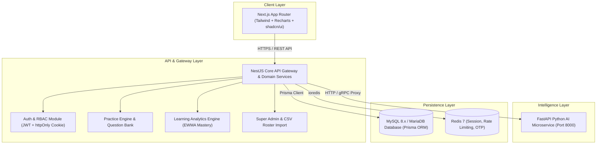

# CLIAS — System Architecture

## 1. High-Level Architecture Diagram

## 2. Component Breakdown

### Frontend (`apps/web`)
- Built with **Next.js App Router** (React 18/19), **TypeScript**, **Tailwind CSS**, and **Recharts**.
- Design System: Custom SaaS aesthetic utilizing card glassmorphism, fluid responsive layouts, micro-animations, loading skeletons, and accessible states.
- Client State & Data Fetching: SWR / TanStack Query patterns with centralized Axios/Fetch API client and JWT handling.

### Backend (`apps/api`)
- Built with **NestJS**, **TypeScript**, and **Prisma ORM**.
- Layered modular architecture:
  - `AuthModule`: Domain validation, OTP generation/verification, password hashing, JWT issue/refresh.
  - `AdminModule`: Authorized student roster CSV upload, streaming validation, institutional structure CRUD.
  - `PracticeModule`: Practice session lifecycle, question retrieval (without correct answer leakage), attempt recording.
  - `AnalyticsModule`: Standalone `LearningAnalyticsService` computing EWMA topic mastery and historical curve snapshots.
  - `UsersModule`: Role queries and user profile management.

### AI Microservice (`apps/ai`)
- Built with **Python 3.10+** and **FastAPI**.
- Exposes `/health` and structured endpoints prepared for future LangChain/LlamaIndex integration, question generation, and misconception vector similarity search.

### Database (`MySQL` via Prisma)
- Strongly normalized relational data model.
- Referential integrity with foreign keys, composite unique constraints (e.g. unique enrollment numbers, unique active user emails).
