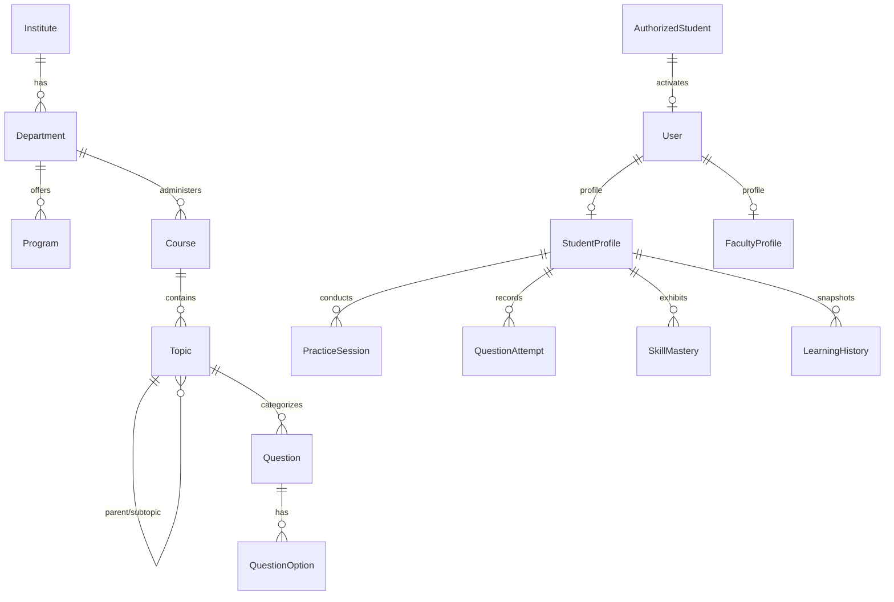

# CLIAS — Database Design Specification

## 1. Relational Entity Overview

## 2. Core Entities (Phase 1)

### `User`
- `id`: String (UUID or CUID, Primary Key)
- `email`: String (Unique, Indexed)
- `passwordHash`: String (Argon2id or bcrypt)
- `role`: Enum (`STUDENT`, `FACULTY`, `COUNSELLOR`, `HOD`, `HEAD`, `SUPER_ADMIN`)
- `status`: Enum (`ACTIVE`, `INACTIVE`, `SUSPENDED`)
- `emailVerified`: Boolean
- `createdAt`, `updatedAt`, `lastLoginAt`

### `AuthorizedStudent`
- `id`: String (PK)
- `enrollmentNumber`: String (Unique, Indexed)
- `name`: String
- `email`: String (Unique, Indexed)
- `instituteId`, `departmentId`, `programId`: Foreign Keys
- `semester`: Int
- `division`: String
- `graduationYear`: Int
- `activated`: Boolean (Default: false)
- `userId`: Nullable FK to `User`

### `Institute`, `Department`, `Program`
- Canonical academic hierarchy.

### `Course` & `Topic`
- `Course`: `code` (e.g. `CS301`), `name` (e.g. `Data Structures`), `semester`.
- `Topic`: `courseId`, `name`, `slug`, `parentTopicId` (Nullable self-relation for subtopics).

### `Question` & `QuestionOption`
- `Question`: `courseId`, `topicId`, `type` (`MCQ_SINGLE`, `MCQ_MULTIPLE`, etc.), `difficulty` (`EASY`, `MEDIUM`, `HARD`), `questionText`, `explanation`, `status` (`APPROVED`).
- `QuestionOption`: `questionId`, `optionText`, `isCorrect` (never sent to student before submission), `order`.

### `PracticeSession` & `QuestionAttempt`
- `PracticeSession`: `studentId`, `courseId`, `topicId`, `difficulty`, `questionsAttempted`, `correctAnswers`, `startedAt`, `completedAt`.
- `QuestionAttempt`: **Immutable**. `studentId`, `questionId`, `practiceSessionId`, `selectedOptionId`, `isCorrect`, `timeTakenSeconds`, `attemptNumber`, `createdAt`.

### `SkillMastery` & `LearningHistory`
- `SkillMastery`: `studentId`, `topicId`, `masteryScore` (Float 0–100), `attemptCount`, `correctCount`, `lastPracticedAt`.
- `LearningHistory`: `studentId`, `topicId`, `masteryScore`, `recordedAt`, `reason` (`PRACTICE_ATTEMPT`, etc.).

---

## 3. Future Entities (Schema Reserved)
- `Test`, `TestQuestion`, `TestAssignment`, `TestAttempt`, `TestAnswer`
- `Misconception`, `StudentMisconception`
- `CounsellorAssignment`
- `FaceEnrollment`, `ProctorSession`, `ProctorEvent`
