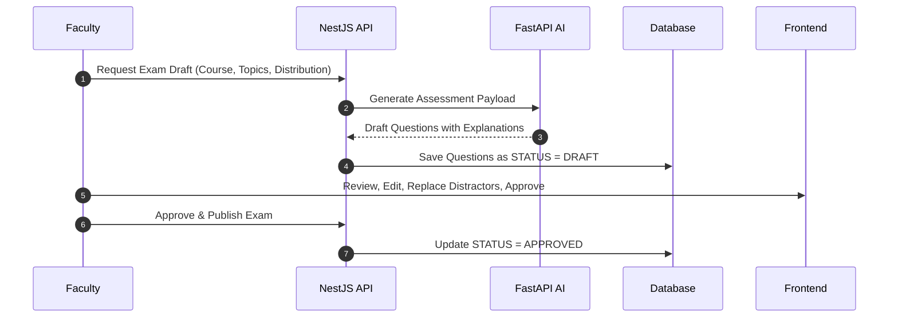

# CLIAS — Future AI Architecture Specification

## 1. AI System Overview
The CLIAS AI subsystem (`apps/ai`) is architected as an autonomous microservice built in Python using FastAPI.

Future phases will unlock:
1. **AI Question & Assessment Generation**
2. **Document/Syllabus Ingestion & RAG**
3. **Misconception Analysis & Socratic Learning Assistant**
4. **Adaptive Practice Engine**

---

## 2. AI Assessment Generation & Approval Pipeline
AI generated assessments must **never** auto-publish into official exams. They follow a strict human-in-the-loop workflow:

---

## 3. Misconception Engine Design
When a student selects an incorrect distractor, the system should not simply say "Wrong". It should detect the underlying misconception:

- **Entity**: `Misconception` (`id`, `topicId`, `title`, `description`, `remedialAdvice`)
- **Entity**: `StudentMisconception` (`studentId`, `misconceptionId`, `occurrences`, `lastObservedAt`)

### Example:
- **Question**: Time complexity of accessing the $k$-th element in a Singly Linked List?
- **Student Option**: $O(1)$
- **Detected Misconception**: Confuses contiguous array random memory indexing with pointer traversal in node-based linked structures.
- **Socratic Intervention**: Explain why indexing requires traversal; recommend a 2-minute visual memory breakdown; offer two follow-up pointer traversal checks.
